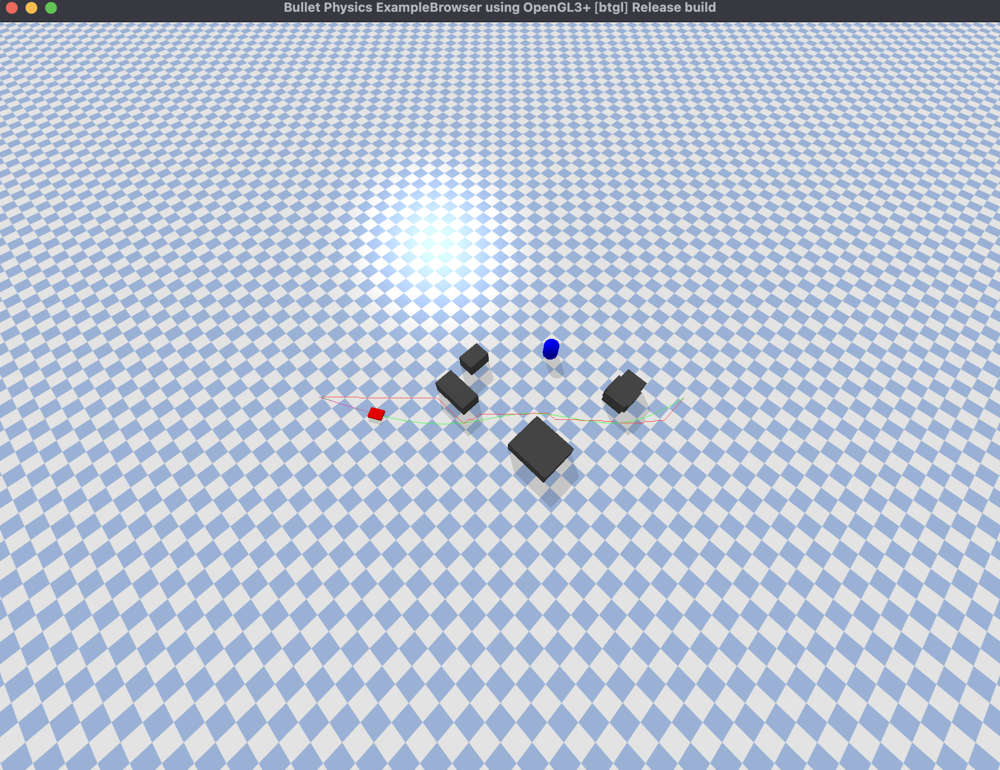

# Robot Planning Coursework 1

## Overview
This project uses `env_factory.py` to generate a randomized warehouse environment for robot planning tasks.
The goal is to navigate from start to goal while avoiding static and dynamic obstacles.

## System Requirements
- Python 3.11 or higher
- PyBullet
- NumPy
- Matplotlib (for C-space visualization)
- SciPy (recommended for path smoothing)

## File Structure
- `env_factory.py`: Original environment file (do not modify/rename)
- `planner.py`: Planning implementations (A*, Weighted A*, RRT-Connect, D* Lite, smoothing, plotting)
- `main.py`: Entry point that runs the full navigation pipeline
- `starter_code.py`: Compatibility wrapper that calls `main.py`

## Important Notes
- You must use the last 4 digits of your student ID as the random seed.
- `version_hash` is used for grading consistency; changing environment logic can invalidate it.
- The dynamic obstacle appears only after calling `env.activate_dynamic_obstacle()`.

## Task 2.3 Multi-Seed Table
- Run `python main.py --headless --no-hold` to generate the 5-seed A* vs RRT-Connect comparison.
- Results are saved to `phase2_task23_multiseed.csv`.
